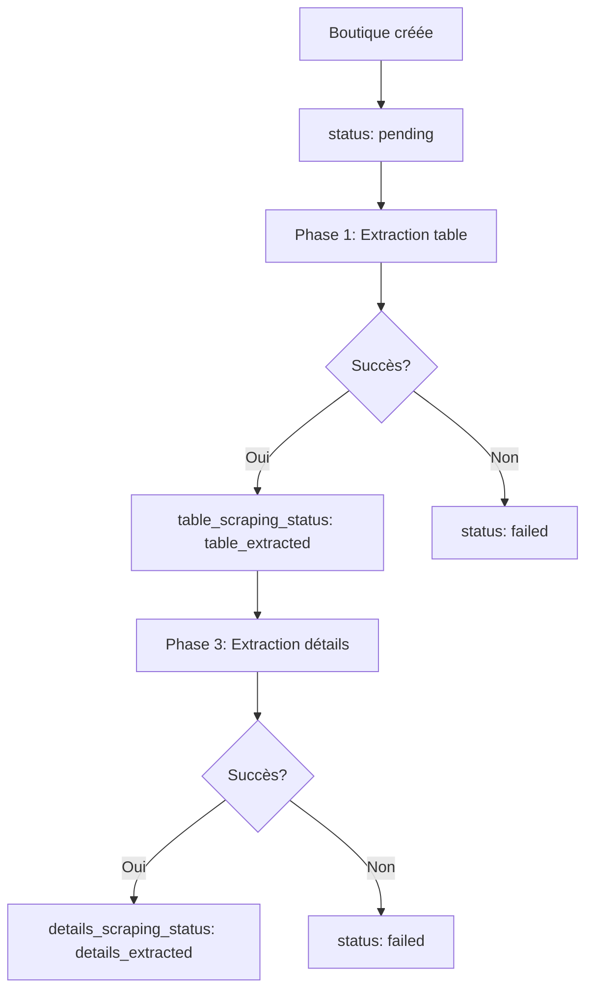

# Modèle de Données TrendTrack MVP Scraper

**Version**: V2  
**Date**: 2025-09-25  
**Statut**: Modèle de données officiel MVP

## 📋 Vue d'ensemble

Ce document décrit le modèle de données utilisé par le scraper TrendTrack MVP, incluant la structure de la base de données, les mappings de données, et les relations entre les entités.

---

## 🗄️ Structure de la Base de Données

### Base de Données Principale

- **Fichier** : `/home/ubuntu/projects/shopshopshops/test/trendtrack-scraper-final/data/trendtrack.db`
- **Type** : SQLite
- **Tables** : `shops` uniquement

### ⚠️ Important : Table `analytics` Non Utilisée

Le scraper MVP **ne met jamais à jour** la table `analytics`. Toutes les données sont stockées dans la table `shops` uniquement.

---

## 📊 Table `shops`

### Structure Complète

```sql
CREATE TABLE IF NOT EXISTS "shops" (
    id INTEGER PRIMARY KEY AUTOINCREMENT,
    shop_name TEXT NOT NULL,
    shop_url TEXT,
    total_products INTEGER,
    monthly_visits INTEGER,
    monthly_revenue TEXT,
    live_ads INTEGER,  -- Publicités actives (INTEGER)
    aov NUMERIC,       -- Average Order Value (NUMERIC)
    page_number TEXT,
    scraped_at TEXT,
    project_source TEXT,
    external_id TEXT,
    metadata TEXT,
    year_founded TEXT,  -- Année de création (TEXT)
    creation_date TEXT,
    scraping_status TEXT DEFAULT 'pending',
    live_ads_7d INTEGER,
    live_ads_30d INTEGER,
    
    -- Nouveaux champs MVP
    table_scraping_status TEXT DEFAULT 'pending',
    details_scraping_status TEXT DEFAULT 'pending',
    
    -- Champs de suivi
    scraping_last_update TEXT,
    updated_at TEXT,
    
    -- Champs pixels et marchés
    pixel_google TEXT,      -- Pixel Google (TEXT)
    pixel_facebook TEXT,    -- Pixel Facebook (TEXT)
    market_us NUMERIC,      -- Marché US (NUMERIC)
    market_uk NUMERIC,      -- Marché UK (NUMERIC)
    market_de NUMERIC,      -- Marché DE (NUMERIC)
    market_ca NUMERIC,      -- Marché CA (NUMERIC)
    market_au NUMERIC,      -- Marché AU (NUMERIC)
    market_fr NUMERIC,      -- Marché FR (NUMERIC)
    category TEXT           -- Catégorie (TEXT)
);
```

### Index

```sql
-- Index existants
CREATE INDEX idx_shops_shop_url ON shops(shop_url);
CREATE INDEX idx_shops_external_id ON shops(external_id);
CREATE INDEX idx_shops_scraping_status ON shops(scraping_status);

-- Nouveaux index MVP
CREATE INDEX idx_shops_table_status ON shops(table_scraping_status);
CREATE INDEX idx_shops_details_status ON shops(details_scraping_status);
```

---

---

## 📈 Mapping des Données

### Phase 1 - Extraction Table

#### Source : Page Trending Shops
- **URL** : `https://app.trendtrack.io/fr/workspace/w-al-yakoobs-workspace-x0Qg9st/trending-shops`
- **Sélecteur** : `tbody tr` (lignes de la table)

#### Mapping des Champs

| Champ Source | Sélecteur | Champ Destination | Type | Description |
|--------------|-----------|-------------------|------|-------------|
| **Shop Name** | `div:first-child p.text-sm.font-semibold` | `shop_name` | TEXT | Nom de la boutique |
| **Shop URL** | `a[href*="http"]` | `shop_url` | TEXT | URL de la boutique |
| **Total Products** | `p.text-sm.font-semibold` | `total_products` | INTEGER | Nombre de produits |
| **Year Founded** | `p.text-[11px]` | `year_founded` | TEXT | Année de création |
| **Live Ads** | `p.font-bold` | `live_ads` | INTEGER | Publicités actives |
| **External ID** | `<tr id="...">` | `external_id` | TEXT | UUID de la ligne |
| **Creation Date** | Timestamp | `creation_date` | TEXT | Date d'ajout (ISO 8601) |

#### Opération SQL

```sql
INSERT OR REPLACE INTO shops (
    shop_name, shop_url, external_id, year_founded,
    creation_date, total_products, live_ads,
    table_scraping_status
) VALUES (
    ?, ?, ?, ?, ?, ?, ?, 'table_extracted'
);
```

### Phase 3 - Extraction Détails

#### Source : Page Détails Boutique
- **URL** : `https://app.trendtrack.io/fr/workspace/w-al-yakoobs-workspace-x0Qg9st/trending-shops/{external_id}`
- **Sélecteur** : `.flex.items-center.gap-2` (contenu principal)

#### Mapping des Champs

| Champ Source | Sélecteur | Champ Destination | Type | Description |
|--------------|-----------|-------------------|------|-------------|
| **Live Ads 7d** | Sélecteur spécifique | `live_ads_7d` | INTEGER | Publicités 7 jours |
| **Live Ads 30d** | Sélecteur spécifique | `live_ads_30d` | INTEGER | Publicités 30 jours |
| **AOV** | Sélecteur spécifique | `aov` | NUMERIC | Average Order Value |
| **Pixel Google** | Sélecteur spécifique | `pixel_google` | TEXT | Pixel Google détecté |
| **Pixel Facebook** | Sélecteur spécifique | `pixel_facebook` | TEXT | Pixel Facebook détecté |
| **Market US** | Sélecteur spécifique | `market_us` | NUMERIC | Marché US |
| **Market UK** | Sélecteur spécifique | `market_uk` | NUMERIC | Marché UK |
| **Market DE** | Sélecteur spécifique | `market_de` | NUMERIC | Marché DE |
| **Market CA** | Sélecteur spécifique | `market_ca` | NUMERIC | Marché CA |
| **Market AU** | Sélecteur spécifique | `market_au` | NUMERIC | Marché AU |
| **Market FR** | Sélecteur spécifique | `market_fr` | NUMERIC | Marché FR |

#### Opération SQL

```sql
UPDATE shops SET 
    live_ads_7d = ?,
    live_ads_30d = ?,
    aov = ?,
    pixel_google = ?,
    pixel_facebook = ?,
    market_us = ?,
    market_uk = ?,
    market_de = ?,
    market_ca = ?,
    market_au = ?,
    market_fr = ?,
    details_scraping_status = 'details_extracted'
WHERE external_id = ?;
```

---

## 🔄 Workflow des Statuts

### Statuts de Scraping

| Statut | Description | Déclencheur |
|--------|-------------|-------------|
| `pending` | En attente | Création initiale |
| `table_extracted` | Table extraite | Fin Phase 1 |
| `details_extracted` | Détails extraits | Succès Phase 3 |
| `failed` | Échec | Échec Phase 3 |

### Workflow Complet



### Requêtes de Statut

```sql
-- Boutiques avec table extraite
SELECT COUNT(*) FROM shops WHERE table_scraping_status = 'table_extracted';

-- Boutiques avec détails extraits
SELECT COUNT(*) FROM shops WHERE details_scraping_status = 'details_extracted';

-- Boutiques en échec
SELECT COUNT(*) FROM shops WHERE scraping_status = 'failed';

-- Taux de succès Phase 3
SELECT 
    COUNT(CASE WHEN details_scraping_status = 'details_extracted' THEN 1 END) * 100.0 / 
    COUNT(*) as success_rate
FROM shops WHERE table_scraping_status = 'table_extracted';
```

---

## 📊 Types de Données

### Types SQLite

| Type | Description | Exemple |
|------|-------------|---------|
| `INTEGER` | Nombre entier | `123`, `2023`, `live_ads` |
| `NUMERIC` | Nombre décimal | `123.45`, `0.05`, `aov`, `market_us` |
| `TEXT` | Chaîne de caractères | `"Shop Name"`, `"2024-01-01T10:00:00Z"`, `pixel_google` |

### Formats Spéciaux

#### Timestamps (ISO 8601)
```sql
-- Format : YYYY-MM-DDTHH:MM:SSZ
'2024-01-01T10:00:00Z'
'2024-12-25T15:30:45Z'
```

#### URLs
```sql
-- Format : URL complète
'https://example-shop.com'
'https://www.shop-name.fr'
```

#### UUIDs (External ID)
```sql
-- Format : UUID v4
'550e8400-e29b-41d4-a716-446655440000'
'a1b2c3d4-e5f6-7890-abcd-ef1234567890'
```

---

## 🔍 Validation des Données

### Contraintes

```sql
-- Contraintes de base
shop_name NOT NULL
shop_url UNIQUE NOT NULL
external_id UNIQUE

-- Contraintes de validation
year_founded BETWEEN 1900 AND 2024
total_products >= 0
live_ads_7d >= 0
live_ads_30d >= 0
aov >= 0
```

### Validation des Données

```sql
-- Vérifier l'intégrité des données
SELECT 
    COUNT(*) as total_shops,
    COUNT(CASE WHEN shop_name IS NULL THEN 1 END) as missing_names,
    COUNT(CASE WHEN shop_url IS NULL THEN 1 END) as missing_urls,
    COUNT(CASE WHEN external_id IS NULL THEN 1 END) as missing_external_ids,
    COUNT(CASE WHEN year_founded < 1900 OR year_founded > 2024 THEN 1 END) as invalid_years
FROM shops;
```

---

## 📈 Métriques de Données

### Métriques de Completude

```sql
-- Completude des champs
SELECT 
    COUNT(*) as total,
    COUNT(shop_name) * 100.0 / COUNT(*) as shop_name_completeness,
    COUNT(shop_url) * 100.0 / COUNT(*) as shop_url_completeness,
    COUNT(external_id) * 100.0 / COUNT(*) as external_id_completeness,
    COUNT(year_founded) * 100.0 / COUNT(*) as year_founded_completeness,
    COUNT(total_products) * 100.0 / COUNT(*) as total_products_completeness,
    COUNT(live_ads_7d) * 100.0 / COUNT(*) as live_ads_7d_completeness,
    COUNT(live_ads_30d) * 100.0 / COUNT(*) as live_ads_30d_completeness,
    COUNT(aov) * 100.0 / COUNT(*) as aov_completeness,
    COUNT(pixel_google) * 100.0 / COUNT(*) as pixel_google_completeness,
    COUNT(pixel_facebook) * 100.0 / COUNT(*) as pixel_facebook_completeness,
    COUNT(market_us) * 100.0 / COUNT(*) as market_us_completeness,
    COUNT(market_uk) * 100.0 / COUNT(*) as market_uk_completeness,
    COUNT(market_de) * 100.0 / COUNT(*) as market_de_completeness,
    COUNT(market_ca) * 100.0 / COUNT(*) as market_ca_completeness,
    COUNT(market_au) * 100.0 / COUNT(*) as market_au_completeness,
    COUNT(market_fr) * 100.0 / COUNT(*) as market_fr_completeness
FROM shops;
```

### Métriques de Performance

```sql
-- Taux de succès par phase MVP
SELECT 
    COUNT(CASE WHEN table_scraping_status = 'table_extracted' THEN 1 END) as phase1_success,
    COUNT(CASE WHEN details_scraping_status = 'details_extracted' THEN 1 END) as phase3_success,
    COUNT(CASE WHEN scraping_status = 'failed' THEN 1 END) as failures,
    COUNT(*) as total
FROM shops;
```

---

## 🔄 Migration et Évolution

### Ajout de Nouveaux Champs

```sql
-- Ajouter un nouveau champ
ALTER TABLE shops ADD COLUMN new_field TEXT;

-- Mettre à jour les index
CREATE INDEX idx_shops_new_field ON shops(new_field);
```

### Migration des Données

```sql
-- Migration des statuts existants
UPDATE shops 
SET table_scraping_status = 'table_extracted'
WHERE scraping_status = 'completed' AND table_scraping_status IS NULL;

UPDATE shops 
SET details_scraping_status = 'details_extracted'
WHERE scraping_status = 'completed' AND details_scraping_status IS NULL;
```

---

## 📚 Références

### Fichiers de Configuration

- **Script principal** : `/home/ubuntu/projects/shopshopshops/test/trendtrack-scraper-final/update-database-mvp.js`
- **Base de données** : `/home/ubuntu/projects/shopshopshops/test/trendtrack-scraper-final/data/trendtrack.db`
- **Schéma** : `plan/prod_schema.sql`

### Documentation Liée

- **Specification** : `/specs/007-trendtrack-mvp-scraper/spec.md`
- **Plan d'implémentation** : `/specs/007-trendtrack-mvp-scraper/plan/plan.md`
- **Scraper classique** : `/specs/001-name-trendtrack-scraper/`

### Outils de Validation

```bash
# Vérifier l'intégrité de la base
sqlite3 data/trendtrack.db "PRAGMA integrity_check;"

# Analyser les performances
sqlite3 data/trendtrack.db "ANALYZE;"

# Statistiques des tables
sqlite3 data/trendtrack.db "SELECT name, sql FROM sqlite_master WHERE type='table';"
```
