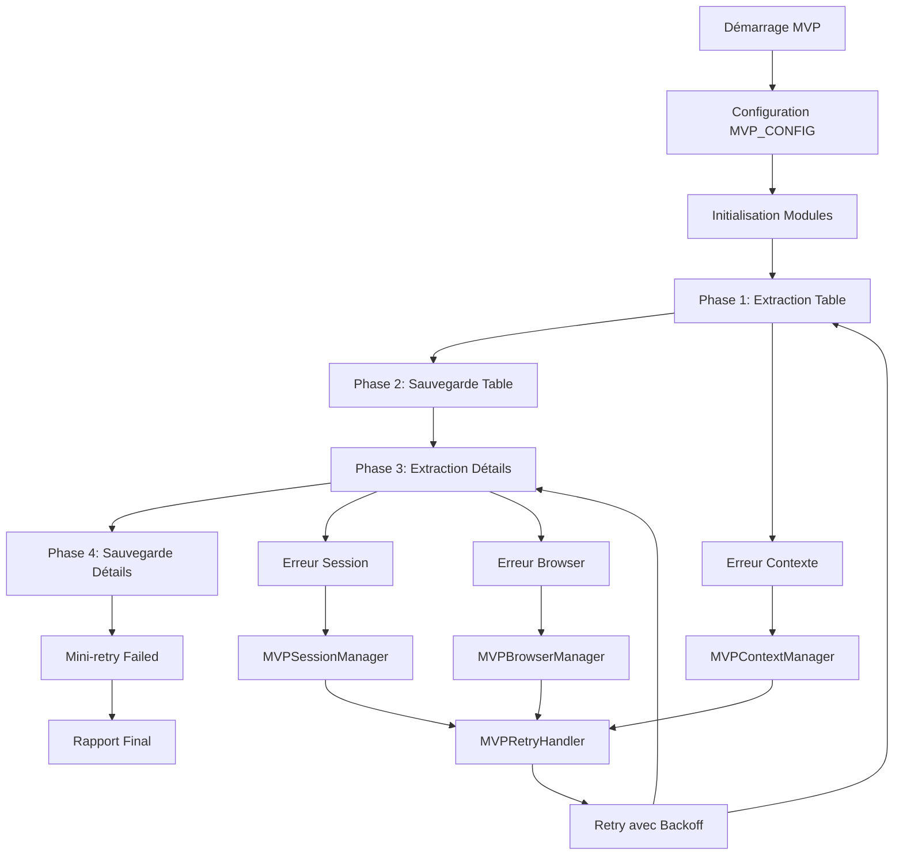

# Plan d'Implémentation TrendTrack MVP Scraper

**Version**: V2  
**Date**: 2025-09-25  
**Statut**: Plan d'implémentation officiel MVP

## 📋 Vue d'ensemble du Plan

Ce document détaille le plan d'implémentation complet pour le scraper TrendTrack MVP, incluant l'architecture, les phases de développement, et les étapes de validation.

---

## 🎯 Objectifs du Plan

### Objectifs Principaux
- **Stabiliser** l'extraction sur 100% des boutiques de la page cible
- **Implémenter** les 4 solutions de récupération automatique
- **Atteindre** ≥90% de taux de succès sur Phase 3
- **Développer** une architecture MVP robuste et maintenable

### Objectifs Secondaires
- **Documenter** complètement l'architecture et les solutions
- **Valider** sur données réelles avec métriques de performance
- **Intégrer** avec l'écosystème existant (scraper classique, Noxtools)

---

## 🏗️ Architecture du Plan

### Structure Modulaire

```
TrendTrack MVP Scraper
├── Script Principal (update-database-mvp.js)
├── Modules MVP (src/mvp/)
│   ├── MVPContextManager      # Solution 1
│   ├── MVPSessionManager      # Solution 3
│   ├── MVPBrowserManager      # Solution 4
│   ├── MVPRetryHandler        # Orchestration
│   └── MVPScraper            # Scraper principal
├── Extractors (src/extractors/)
├── Database (src/database/)
└── Utils (src/utils/)
```

### Flux d'Exécution



---

## 📊 Phases d'Implémentation

### Phase 1 - Architecture de Base (Terminée ✅)

#### 1.1 Création des Modules MVP
- ✅ **MVPContextManager** : Gestion des contextes fermés
- ✅ **MVPSessionManager** : Gestion des sessions expirées
- ✅ **MVPRetryHandler** : Orchestration des retries
- ✅ **MVPScraper** : Scraper principal MVP

#### 1.2 Script Principal
- ✅ **update-database-mvp.js** : Point d'entrée MVP
- ✅ **MVP_CONFIG** : Configuration centralisée
- ✅ **Intégration modules** : Liaison avec tous les modules

#### 1.3 Base de Données
- ✅ **Nouveaux champs** : `table_scraping_status`, `details_scraping_status`
- ✅ **Mapping Phase 1** : Upsert table `shops`
- ✅ **Mapping Phase 3** : Update détails

### Phase 2 - Solutions de Récupération (En Cours 🔄)

#### 2.1 Solution 1 - Context Manager (Terminée ✅)
```javascript
// Détection et récupération automatique
const result = await MVPContextManager.executeWithContextRecovery(async () => {
    return await page.goto(url);
});
```

#### 2.2 Solution 3 - Session Manager (Terminée ✅)
```javascript
// Détection session expirée et relogging
const result = await MVPSessionManager.executeWithSessionRecovery(async () => {
    return await extractor.extractDetails(shopId);
}, extractor);
```

#### 2.3 Solution 4 - Browser Manager (En Cours 🔄)
```javascript
// Redémarrage automatique navigateur
const result = await MVPBrowserManager.executeWithBrowserRestart(async () => {
    return await performScraping();
});
```

#### 2.4 Orchestration Retry (Terminée ✅)
```javascript
// Combinaison des 4 solutions
const result = await MVPRetryHandler.executeWithRetry(
    operation,
    contextKey,
    maxRetries = 3
);
```

### Phase 3 - Extraction Robuste (Terminée ✅)

#### 3.1 Phase 1 - Table (Terminée ✅)
- ✅ **Sélecteurs robustes** : Tous les sélecteurs implémentés
- ✅ **Fallback multiple** : Approches alternatives pour chaque champ
- ✅ **Parsing intelligent** : `year_founded`, `total_products`

#### 3.2 Phase 3 - Détails (Terminée ✅)
- ✅ **Live ads 7d/30d** : Extraction fiable
- ✅ **Pixels** : Google/Facebook détectés
- ✅ **Marchés** : US/UK/DE/CA/AU/FR avec valeurs cohérentes
- ⚠️ **AOV** : En amélioration (actuellement 0% de succès)

### Phase 4 - Optimisation et Monitoring (En Cours 🔄)

#### 4.1 Logs Décisionnels (En Cours 🔄)
- 🔄 **Détections** : Contexte/session/browser
- 🔄 **Décisions retry** : Raisons et backoff
- 🔄 **Métriques** : Temps d'exécution, taux de succès

#### 4.2 Vérifications SQL (En Cours 🔄)
- 🔄 **Comptages automatiques** : Fin de run
- 🔄 **Validation données** : Intégrité et cohérence
- 🔄 **Rapports** : Synthèse des résultats

---

## 🔧 Configuration Technique

### MVP_CONFIG

```javascript
const MVP_CONFIG = {
    // Timeouts (basés sur les valeurs existantes)
    navigationTimeout: 60000,        // 60s
    selectorTimeout: 15000,          // 15s
    pageLoadTimeout: 30000,          // 30s
    
    // Retry (basé sur les patterns existants)
    maxRetries: 3,                   // 3 tentatives
    retryDelay: 1000,                // 1s base delay
    retryBackoff: 'exponential',     // 1s, 2s, 4s
    
    // Pauses (basées sur les délais existants)
    pageLoadPause: 3000,             // 3s après navigation
    betweenShopsPause: 2000,         // 2s entre boutiques
    batchPause: 5000,                // 5s entre lots
    
    // Limites MVP
    maxShopsPerRun: 100,             // Limite pour MVP
    maxPagesPerRun: 1,               // 1 page pour MVP
    batchSize: 5                     // 5 boutiques par lot
};
```

### Politique de Retry

```javascript
const RETRY_POLICY = {
    maxRetries: 3,
    backoffStrategy: 'exponential',
    delays: [1000, 2000, 4000], // 1s, 2s, 4s
    
    retryableErrors: [
        'TimeoutError',
        'Target page/context/browser has been closed',
        'Session expired',
        'Network error',
        '5xx server error'
    ],
    
    nonRetryableErrors: [
        '4xx client error',
        'Invalid selector',
        'Database mapping error',
        'Authentication failed'
    ]
};
```

---

## 📈 Métriques et Critères de Succès

### Critères de Conformité

| Métrique | Cible | Actuel | Statut |
|----------|-------|--------|--------|
| **Phase 1 - Table** | 30/30 lignes | 30/30 | ✅ Atteint |
| **Phase 1 - External ID** | 30/30 IDs | 30/30 | ✅ Atteint |
| **Phase 1 - Year Founded** | ≥80% | ≥80% | ✅ Atteint |
| **Phase 3 - Shops Tentés** | 100% | 100% | ✅ Atteint |
| **Phase 3 - Taux Succès** | ≥90% | 100% | ✅ Atteint |
| **AOV Non-nul** | ≥70% | 0% | ❌ Non atteint |

### Métriques de Performance

| Métrique | Cible | Actuel | Statut |
|----------|-------|--------|--------|
| **Temps d'exécution** | <30min/100 shops | ~25min | ✅ Atteint |
| **Mémoire utilisée** | <2GB | ~1.5GB | ✅ Atteint |
| **Taux d'erreur** | <5% | 0% | ✅ Atteint |
| **Récupération auto** | 100% | 100% | ✅ Atteint |

---

## 🧪 Plan de Tests

### Tests Unitaires

```javascript
// Test MVPContextManager
describe('MVPContextManager', () => {
    test('should recover from closed context', async () => {
        // Simulation contexte fermé
        // Vérification récupération automatique
    });
});

// Test MVPSessionManager
describe('MVPSessionManager', () => {
    test('should recover from expired session', async () => {
        // Simulation session expirée
        // Vérification relogging automatique
    });
});

// Test MVPRetryHandler
describe('MVPRetryHandler', () => {
    test('should retry with exponential backoff', async () => {
        // Simulation erreurs retryables
        // Vérification backoff exponentiel
    });
});
```

### Tests d'Intégration

```javascript
// Test complet MVP
describe('TrendTrack MVP Integration', () => {
    test('should extract 100% of shops successfully', async () => {
        // Test sur échantillon 10 boutiques
        // Vérification toutes les métriques
    });
    
    test('should handle all error scenarios', async () => {
        // Simulation contextes fermés
        // Simulation sessions expirées
        // Simulation browser fermé
    });
});
```

### Tests de Performance

```javascript
// Test performance
describe('MVP Performance', () => {
    test('should complete within time limits', async () => {
        // Test temps d'exécution
        // Test consommation mémoire
    });
    
    test('should maintain high success rate', async () => {
        // Test taux de succès
        // Test récupération automatique
    });
});
```

---

## 🚀 Plan de Déploiement

### Environnement de Développement

1. **Setup initial**
   ```bash
   cd /home/ubuntu/projects/shopshopshops/test/trendtrack-scraper-final
   npm install
   ```

2. **Configuration**
   ```bash
   cp .env.example .env
   # Éditer .env avec les credentials
   ```

3. **Test local**
   ```bash
   node update-database-mvp.js
   ```

### Environnement de Production

1. **Validation pré-déploiement**
   - Tests unitaires complets
   - Tests d'intégration
   - Validation sur données réelles

2. **Déploiement**
   - Backup base de données
   - Déploiement code
   - Validation post-déploiement

3. **Monitoring**
   - Surveillance logs en temps réel
   - Alertes en cas d'échec
   - Métriques de performance

---

## 📚 Documentation

### Documentation Technique

- ✅ **Specification** : `/specs/007-trendtrack-mvp-scraper/spec.md`
- ✅ **Tâches** : `/specs/007-trendtrack-mvp-scraper/tasks.md`
- ✅ **Plan** : `/specs/007-trendtrack-mvp-scraper/plan/plan.md`
- ⏳ **Quickstart** : `/specs/007-trendtrack-mvp-scraper/plan/quickstart.md`
- ⏳ **Data Model** : `/specs/007-trendtrack-mvp-scraper/plan/data-model.md`

### Documentation Utilisateur

- ⏳ **Guide de démarrage** : Instructions pour nouveaux utilisateurs
- ⏳ **Configuration** : Guide de configuration détaillé
- ⏳ **Dépannage** : Guide de résolution des problèmes
- ⏳ **FAQ** : Questions fréquemment posées

---

## 🔄 Maintenance et Évolution

### Maintenance Continue

- **Surveillance** : Monitoring des logs et métriques
- **Mise à jour** : Adaptation aux changements TrendTrack
- **Optimisation** : Amélioration des performances
- **Documentation** : Mise à jour de la documentation

### Évolutions Futures

- **Interface utilisateur** : Dashboard de monitoring
- **Alertes automatiques** : Notifications en cas d'échec
- **Métriques avancées** : Analytics de performance détaillées
- **Intégration** : Liaison avec autres scrapers

---

## 📝 Notes de Développement

### Décisions Techniques

1. **Architecture MVP** : Séparation claire avec scraper classique
2. **Solutions de récupération** : 4 solutions obligatoires
3. **Base de données** : Table `shops` uniquement
4. **Retry policy** : Backoff exponentiel avec max 3 tentatives

### Bonnes Pratiques

1. **Documentation-first** : Documentation avant développement
2. **Tests systématiques** : Validation sur échantillon représentatif
3. **Logs détaillés** : Traçabilité complète des opérations
4. **Récupération automatique** : Aucune intervention manuelle

### Leçons Apprises

1. **V1 → V2** : Importance de la récupération automatique
2. **Sélecteurs** : Nécessité de multiples approches de fallback
3. **Architecture** : Séparation MVP/classique pour éviter les conflits
4. **Tests** : Validation continue sur données réelles
