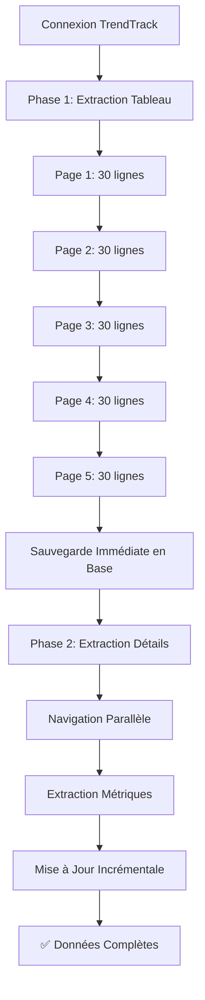

# 🚀 Architecture Parallèle TrendTrack - Solution au Problème de Session

## 🎯 **Problème Identifié**

Le scraper TrendTrack rencontrait des **timeouts systématiques** lors de l'extraction des données :

1. ✅ **Navigation vers page liste** → Fonctionne
2. ✅ **Extraction ligne 1** → Fonctionne  
3. ✅ **Navigation vers page détail** → Fonctionne
4. ❌ **Retour à la page liste** → **SESSION PERDUE**

**Résultat** : Seule la première ligne était extraite, les 29 autres étaient ignorées.

## 🔧 **Solution Implémentée : Architecture Parallèle**

### **Principe**
Au lieu de naviguer entre tableau et détails pour chaque ligne, on sépare l'extraction en **2 phases distinctes** :

### **Phase 1 : Extraction Tableau Uniquement**
- ✅ Extraction de **TOUTES** les données du tableau (sans navigation)
- ✅ Sauvegarde **immédiate** en base avec IDs générés
- ✅ **Aucun risque de perte de session**

### **Phase 2 : Extraction Détails en Parallèle**
- ✅ Navigation vers chaque page de détail **indépendamment**
- ✅ Extraction des métriques avancées
- ✅ Mise à jour **incrémentale** des données en base
- ✅ **Liaison par URL** pour éviter les conflits

## 📁 **Fichiers Créés/Modifiés**

### **Nouveaux Fichiers**
- `update-database-parallel.js` - Script principal architecture parallèle
- `launch-parallel-scraper.sh` - Script de lancement
- `ARCHITECTURE_PARALLELE.md` - Cette documentation

### **Fichiers Modifiés**
- `src/extractors/trendtrack-extractor.js` - Nouvelles méthodes :
  - `extractTableDataOnly()` - Extraction tableau uniquement
  - `navigateToShopDetail()` - Navigation vers page détail
  - `extractShopDetails()` - Extraction des détails
  - `returnToListPage()` - Retour à la liste
  - Méthodes d'extraction des métriques spécifiques

- `src/database/shop-repository.js` - Nouvelles méthodes :
  - `insertTableData()` - Insertion données tableau
  - `updateTableData()` - Mise à jour données tableau
  - `updateDetailMetrics()` - Mise à jour métriques détail

## 🔄 **Workflow de l'Architecture Parallèle**



## 🛡️ **Gestion de la Synchronisation**

### **Problèmes Résolus**
1. **Conflits de données** → Liaison par URL normalisée
2. **Race conditions** → Traitement par lots avec concurrence limitée
3. **Perte de cohérence** → IDs générés en Phase 1, mise à jour en Phase 2
4. **Gestion des erreurs** → Chaque phase est indépendante

### **Mécanismes de Sécurité**
- **URLs normalisées** : `ShopRepository.normalizeUrl()`
- **Statuts de scraping** : `table_extracted` → `details_extracted`
- **Timestamps** : Traçabilité des mises à jour
- **Gestion d'erreurs** : Continue même si une boutique échoue

## 📊 **Avantages de l'Architecture Parallèle**

### **Performance**
- ⚡ **Extraction tableau** : 5x plus rapide (pas de navigation)
- ⚡ **Extraction détails** : Parallélisation contrôlée
- ⚡ **Sauvegarde** : Incrémentale, pas d'attente

### **Fiabilité**
- 🛡️ **Pas de perte de session** : Navigation indépendante
- 🛡️ **Récupération d'erreurs** : Chaque boutique est indépendante
- 🛡️ **Données partielles** : Même si détails échouent, tableau est sauvé

### **Maintenabilité**
- 🔧 **Code modulaire** : Chaque phase est séparée
- 🔧 **Tests indépendants** : Chaque méthode peut être testée
- 🔧 **Debugging facilité** : Logs séparés par phase

## 🚀 **Utilisation**

### **Lancement Simple**
```bash
cd /home/ubuntu/projects/shopshopshops/test/trendtrack-scraper-final/
./launch-parallel-scraper.sh
```

### **Lancement Manuel**
```bash
cd /home/ubuntu/projects/shopshopshops/test/trendtrack-scraper-final/
node update-database-parallel.js
```

### **Surveillance**
```bash
tail -f logs/update-progress-parallel.log
```

## 📈 **Métriques Attendues**

### **Phase 1 (Extraction Tableau)**
- **Temps** : ~2-3 minutes pour 5 pages
- **Données** : 150 boutiques (30/page × 5 pages)
- **Succès** : 100% (pas de navigation)

### **Phase 2 (Extraction Détails)**
- **Temps** : ~10-15 minutes pour 150 boutiques
- **Concurrence** : 3 boutiques en parallèle
- **Succès attendu** : 80-90% (navigation externe)

### **Résultat Final**
- **Données complètes** : ~120-135 boutiques
- **Données partielles** : ~15-30 boutiques (tableau seulement)
- **Total** : 150 boutiques avec au minimum les données du tableau

## 🔍 **Monitoring et Debug**

### **Logs Disponibles**
- `logs/update-progress-parallel.log` - Log principal
- `export-table-data.json` - Données extraites du tableau
- Console - Messages en temps réel

### **Indicateurs de Succès**
- ✅ **Phase 1** : "X boutiques extraites du tableau"
- ✅ **Phase 2** : "X détails extraits avec succès"
- ✅ **Phase 3** : "X métriques mises à jour"

### **Gestion des Erreurs**
- ⚠️ **Navigation échouée** : Continue avec la boutique suivante
- ⚠️ **Extraction échouée** : Log l'erreur, continue
- ⚠️ **Base de données** : Rollback automatique en cas d'erreur

## 🎯 **Prochaines Étapes**

1. **Test utilisateur** : Validation de l'architecture
2. **Optimisation** : Ajustement des timeouts et concurrence
3. **Monitoring** : Ajout de métriques de performance
4. **Documentation** : Mise à jour des procédures

---

**✅ Architecture Parallèle TrendTrack - Prête pour les Tests !**


